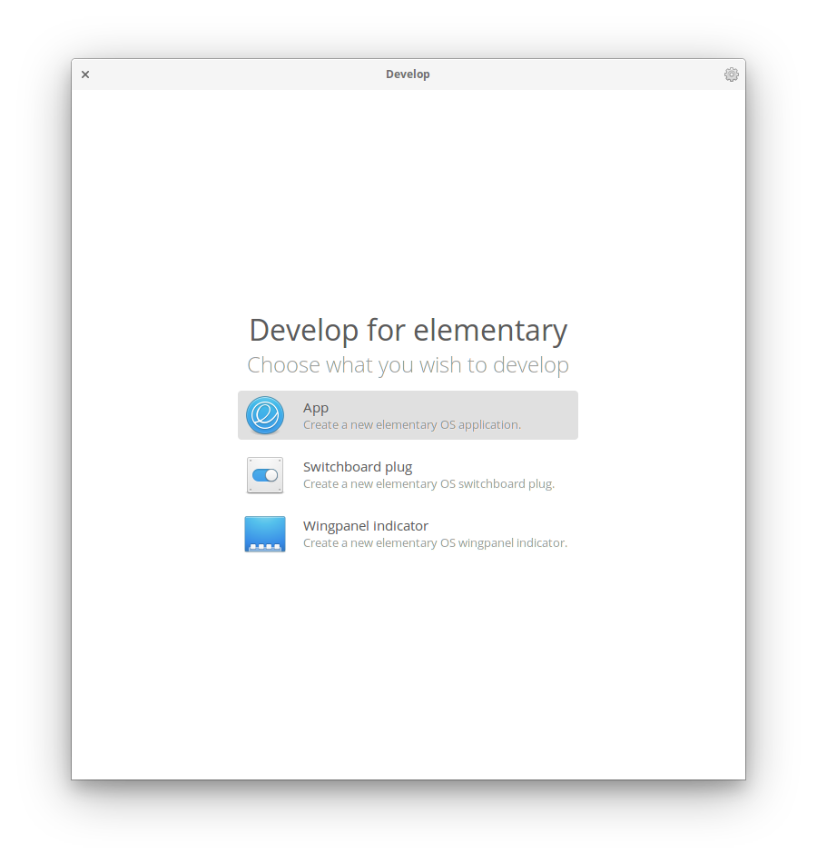

Develop
=======

[](https://travis-ci.org/alcadica/develop)

A simple tool to help Elementary OS developers to develop their own apps and widgets.



## Get it from the elementary OS AppCenter!

[](https://appcenter.elementary.io/com.github.alcadica.develop)

Develop will be available soon(ish) from the elementary OS AppCenter.

# Install it from source

You can of course download and install Develop from source.

## Dependencies

Ensure you have these dependencies installed

* granite
* gtk+-3.0
* switchboard-2.0

## Install, build and run

```bash
# install elementary-sdk, meson and ninja 
sudo apt install elementary-sdk meson ninja
# clone repository
git clone https://github.com/alcadica/develop com.github.alcadica.develop
# cd to dir
cd com.github.alcadica.develop
# run meson
meson build --prefix=/usr
# cd to build, build and test
cd build
sudo ninja install && com.github.alcadica.develop
```

## Generating pot file

```bash
# after setting up meson build
cd build

# generates pot file
sudo ninja com.github.alcadica.develop-pot

# to regenerate and propagate changes to every po file
sudo ninja com.github.alcadica.develop-update-po
```